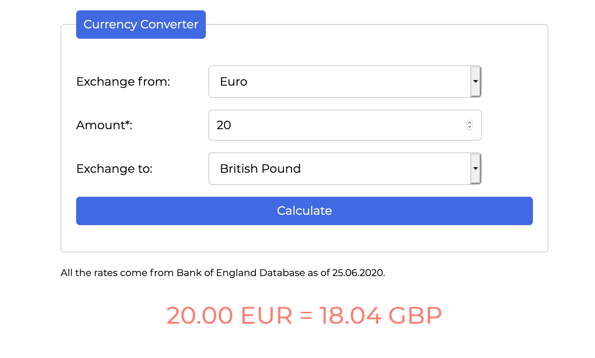

# FX Exchange

## Demo

 https://zwierzbo.github.io/currencyConverter/

## Content Description

The website contains a simply designed, yet powerful currency converter supporting four currencies. To start, choose the currencies for your operation and simply insert the amount of money you wish to exchange. Then, hit enter or "Calculate" button and the equivalent amount will display on the screen. CSS is styled in accordance with BEM. Have fun! :) 

## Javascript in the project
- form element interactions 
- switch
